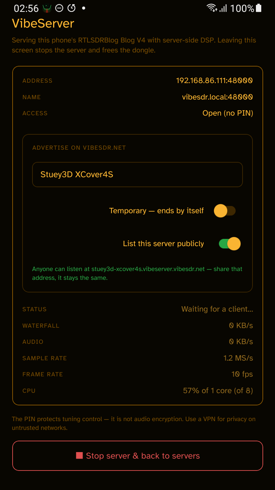

# VibeSDR

**Vibe-coded, but not slop.** A whole SDR ecosystem optimised for mobile that scales from a tiny
Apple Watch to a large desktop. And with **VibeServer**, share your radio with the world from a
spare Android phone or a Linux box in a drawer.

---

# 📻 [→ Browse live receivers](https://vibeserver.vibesdr.net)

### Real radios, shared by real people. Nothing to install — open it and tune.

## 🛜 [→ Share yours](#share-your-radio)

**Every receiver on that list is somebody's spare dongle.** A Raspberry Pi, an old Android phone,
a Linux box in a drawer — plug a radio in, run VibeServer, and anyone can listen from a browser.
It takes about five minutes, and the more of us who do it, the better the map gets.

---

### Everything else

| | |
|---|---|
| 💬 **[Discord](https://discord.gg/pr9EjUUBCA)** | Where the testing, the bug reports and the DX chat happen. |
| 🤖 **[Android test group](https://groups.google.com/g/vibesdr-play-store-test)** | Join this to get the Android app from Play. |
| 📱 **[VibeSDR on the App Store](https://apps.apple.com/gb/app/vibesdr/id6786344049)** | iPhone + iPad, with the Apple Watch remote included. |
| ⌚ **[VibeSDR Jr on the App Store](https://apps.apple.com/gb/app/vibesdr-jr/id6795507029)** | The standalone Apple Watch receiver — no phone involved. |
| 🖥 **[VibeServer downloads](https://github.com/Stuey3D/VibeSDR/releases/latest)** | macOS app, and `apt` for Linux. |
| 🌐 **[vibesdr.net](https://vibesdr.net)** · **[demo receiver](https://demo.vibesdr.net)** | The site, and our own radio to try right now. |

Building it yourself is free, forever — the App Store price is Apple's fee, not a paywall.

---

## What it is

Four things that share one DSP engine and one design:

- **The app** — iPhone, iPad and Android. Connect to a shared receiver, or plug an RTL-SDR
  straight into an Android phone and run the whole radio on the handset.
- **The watch** — the live spectrum drawn *on the watch*, tuned with the Digital Crown. Either as
  a remote for your phone, or as **Jr**, a standalone receiver with its own connection and audio.
- **VibeServer** — turns a Raspberry Pi, a Linux box, a Mac or a spare Android phone into a
  receiver anyone can listen to in a browser. Roughly 25× lighter on the wire than raw `rtl_tcp`.
- **The web client** — served by VibeServer itself. No install, works on any modern browser.

It speaks **UberSDR**, **OpenWebRX / OpenWebRX+**, **KiwiSDR**, **FM-DX Webserver**, **SpyServer**,
plain **rtl_tcp**, and its own VibeServer protocol.

## What actually sets it apart

Most SDR clients are a socket and a picture — they ask the server for a waterfall image, put it on
screen, and tune with a slider. If that's the category, VibeSDR isn't in it.

- **It renders its own waterfall**, from raw FFT bins in a GPU shader, synthesising the lines
  between data frames and repainting your whole history the instant you change a palette.
- **It demodulates on the device.** A clean-room ARM-NEON DSP engine written from scratch — no
  SDR++, no FFTW, no VOLK — with true Weaver SSB, FM stereo with a 19 kHz pilot PLL, RDS, and MMSE
  noise reduction.
- **The tuning is a flywheel with mass**, detents and speed-adaptive haptics, not a slider. It's
  modelled on an analogue dial because that's what it's meant to feel like.
- **The waterfall runs on your wrist.** Not media buttons — the real spectrum, about a third of one
  CPU core, phone locked in your pocket.

Judge it on the feel. That's the part a screenshot can't show, and the part we care most about.

## Share your radio

**VibeServer** shares one or more receivers to anyone with a browser, with server-side DSP,
compressed audio, an optional PIN, per-band gain ceilings and session limits. It runs on a
Raspberry Pi, any Linux box, a Mac, or an Android phone with the radio plugged into it.

**Linux** (arm64 and amd64):

```bash
curl -fsSL https://apt.vibesdr.net/KEY.gpg \
  | sudo gpg --dearmor -o /usr/share/keyrings/vibesdr.gpg
echo "deb [arch=arm64,amd64 signed-by=/usr/share/keyrings/vibesdr.gpg] https://apt.vibesdr.net stable main" \
  | sudo tee /etc/apt/sources.list.d/vibesdr.list
sudo apt update && sudo apt install vibeserver
```

**macOS** — download from [the latest release](https://github.com/Stuey3D/VibeSDR/releases/latest),
unzip, drag to Applications. Notarised, so it opens without a Gatekeeper warning.

**Android** — install the app, plug in the radio, tap **Use as server**.

|  |
|:---:|
| *A £100 rugged Android phone with a £30 dongle, serving to the world. 57% of one core of eight, and a public address that stays the same.* |

Supported hardware — four radios, though not all of them on every host:

| Radio | Linux · macOS | Android |
|---|:---:|:---:|
| **RTL-SDR** — all the usual dongles, including the Blog V4 | ✅ | ✅ |
| **Airspy HF+** — Discovery and Dual Port | ✅ | ✅ |
| **SDRplay RSP** — needs SDRplay's own API installed | ✅ | ✕ |
| **HackRF One** — ⚠️ experimental, see below | ✅ | ✅ |

**SDRplay is desktop-only** because the RSP API is SDRplay's own closed-source library and there is
no Android build of it — nothing we can fix at this end. On a phone, use one of the other three.

**The HackRF is experimental**: nobody on the VibeSDR side owns one, so the driver was written from
the documentation and has been tested by a single listener. It works — FM stereo with RDS, the lot
— it just has not had the miles the other three have. Reports very welcome.

Optionally publish your receiver to the [public directory](https://vibeserver.vibesdr.net) through
a Cloudflare tunnel — your home address is never exposed.

## On AI, honestly

**It's in the name.** VibeSDR is vibe-coded — one curious listener working with Claude — and it's
called that on purpose, so nobody has to discover it, suspect it, or be told by someone in a
comments section.

The scepticism is earned, though. There's a pattern about: a closed-source app, an AI-generated
feature list longer than one person could have tested, decoders that "work" with no antenna
plugged in, someone else's GPL code quietly folded in without credit, and a price on the end.
**That's not a tooling problem — it's an honesty problem**, and the AI made none of those choices.

So the fix isn't to hide the tooling. It's to be checkable:

- **The source is open.** GPLv3, all of it. The store binary is this tree.
- **Everyone who contributed is credited** and the licences are honoured — see [Credits](#credits).
- **Nothing is claimed that isn't there.** Every feature here exists, on a device, used on the air.
  Find one that doesn't work and that's a bug I want — [open an issue](https://github.com/Stuey3D/VibeSDR/issues).
- **It leaves features on the table on purpose** — no DAB+, DRM, HD Radio or DMR, because those
  codecs are patent-encumbered, and no WebSDR, because its author doesn't sanction third-party
  clients. Both cost real features. Saying no is the expensive option, and the one nobody fakes.

## Tested on

Not a spec sheet — the devices every feature has actually been driven on, on the air:

| | |
|---|---|
| **iPhone 17 Pro Max** | the easy one, where everything works |
| **iPhone SE (2nd gen)** | a 2020 A13 with a 4.7″ screen — the layout floor |
| **Moto G35 · Galaxy XCover 4s** | budget Android — the thermal and DSP floor |
| **Galaxy Tab A9 · iPad Air 13″** | tablet layouts, landscape decoders |
| **Apple Watch Ultra** | the wrist waterfall |
| **Raspberry Pi 500 · x86 Linux · macOS** | VibeServer hosts |

The ones that matter are the SE and the budget Androids. Anyone can test where everything already
works.

## Screenshots

|  |  |  |
|:---:|:---:|:---:|

|  |  |  |
|:---:|:---:|:---:|

|  |  |  |
|:---:|:---:|:---:|

## Building

```bash
npm install
cd ios && pod install && cd ..     # iOS only
npx expo run:ios                   # or: npx expo run:android
```

VibeServer builds with CMake from `vibeserver/` (Linux and macOS) — see `vibeserver/linux/INSTALL.md`.
Design notes and specifications for individual features live in [`briefs/`](briefs/).

## Credits

| Name | Role |
|---|---|
| **Stuart Carr (Stuey3D)** | UI/UX design, concept & testing |
| **madpsy (M9PSY)** | Creator of UberSDR — protocol, DSP algorithms (NR2 / noise blanker / WebSDR-NR), colour palettes, band plans and bookmark format |
| **Phil Karn (KA9Q)** | [ka9q-radio](https://github.com/ka9q/ka9q-radio) — the SDR engine underneath UberSDR, and (GPL-3.0) the design reference for VibeSDR's front-end automatic gain: IF-power level targeting, proportional correction and snap-to-hardware-steps. Read and credited, never copied |
| **John Seamons (ZL/KF6VO)** | Creator of KiwiSDR |
| **Jakob Ketterl (DD5JFK) & the OpenWebRX+ project** | OpenWebRX / OpenWebRX+ servers |
| **NoobishSVK & contributors** | FM-DX Webserver + the servers.fmdx.org receiver map — protocol reference for the FM-DX backend and its 3LAS MP3 audio (GPL-3.0) |
| **Hans van Eijsden (FMDX.org)** | Calibration and validation of the Advanced RDS analyser against a Pira FM broadcast analyser — he found that our phase reading was its own reflection and that the deviation figures were scaled wrong, and kept testing until they agreed |
| **Oona Räisänen (windytan)** | [redsea](https://github.com/windytan/redsea) (MIT) — the reference for VibeDSP's weak-signal RDS block recovery: syndrome-table burst correction, rhythm-based sync acquisition and error-rate sync dropping. No redsea code is used; the ideas are hers |
| **Konrad Kosmatka** | librdsparser — reference for the RDS PI + ECC → country mapping (IEC 62106) behind the RDS country flags |
| **radio-browser.info** | Community station directory used to look up FM-DX / RDS station logos |
| **Osmocom / librtlsdr** | RTL-SDR USB driver (Android local hardware + rtl_tcp) |
| **Airspy** | libairspyhf (BSD-3) — the Airspy HF+ driver |
| **Great Scott Gadgets** | libhackrf (GPL-2.0-or-later) |
| **SDRplay Ltd** | The RSP API — headers only; the closed-source library is never bundled |
| **Mark Borgerding (KissFFT)** | BSD-licensed FFT vendored in the VibeDSP engine |
| **Karlis Goba (ft8_lib)** | FT8 / FT4 decoding |
| **Xiph.Org Foundation** | Opus audio codec |
| **Ethan Halsall** | [opus-decoder / wasm-audio-decoders](https://github.com/eshaz/wasm-audio-decoders) (MIT) — libopus in WebAssembly, which is how VibeServer's web client decodes Opus on a plain `http://` LAN address |
| **EiBi** | Shortwave broadcast schedules for live station bookmarks |
| **Leaflet & OpenStreetMap** | Map rendering and tiles |
| **Braille Institute** | Atkinson Hyperlegible typeface |
| **Claude (Anthropic)** | AI coding and development assistant |
| **Expo, React Native, Hermes, Skia, Reanimated, Gesture Handler, OkHttp** | App framework and native stack |

## Questions people actually ask

**Why no WebSDR support?** WebSDR is closed-source and its author has not sanctioned third-party
clients. VibeSDR only implements platforms that welcome independent clients. Out of respect for
that, WebSDR support will not be added.

**Why no native DAB+, DRM, HD Radio or DMR?** Patents, not difficulty. HD Radio is Xperi's; DAB+
and DRM need HE-AAC / xHE-AAC licensing; DMR, D-STAR, System Fusion and NXDN need the AMBE/IMBE
vocoders (DVSI). Shipping unlicensed implementations in store builds is a risk VibeSDR won't take.
Where an OpenWebRX server decodes those modes *server-side*, VibeSDR simply plays the PCM it sends
— no codec ships in, or runs inside, the app. Codec2-based FreeDV and M17 are unencumbered and
remain candidates.

**Why do the skip buttons vanish on FM-DX?** An FM-DX Webserver is one physical tuner shared by
everyone connected — tuning it retunes it for all of them. Lock-screen and in-car skip buttons
would let you change the station for people you can't see, so they're disabled out of courtesy.
On the watch, the Crown is disarmed until you deliberately arm it.

## Privacy

No personal data, no analytics, no ads, no tracking. Location is optional and used only to sort
receivers by distance. See [`PRIVACY.md`](PRIVACY.md).

## Licence

**GNU General Public License v3.** Redistribute and modify it under those terms; it comes with no
warranty. Full text: <https://www.gnu.org/licenses/gpl-3.0.html>

Official App Store / Google Play builds carry an additional permission under GPLv3 §7 — see
[`APPSTORE-EXCEPTION.md`](APPSTORE-EXCEPTION.md). The complete source for every released build
stays here under the GPLv3.

UberSDR, OpenWebRX / OpenWebRX+, KiwiSDR and FM-DX Webserver are the property of their respective
creators and subject to their own licence terms.
